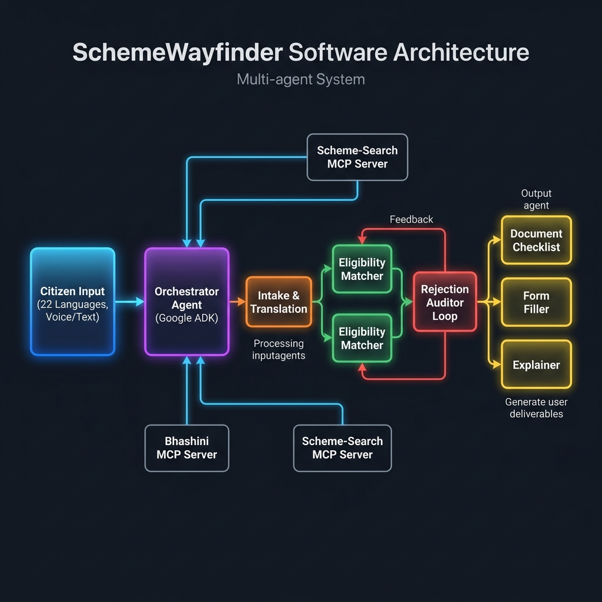
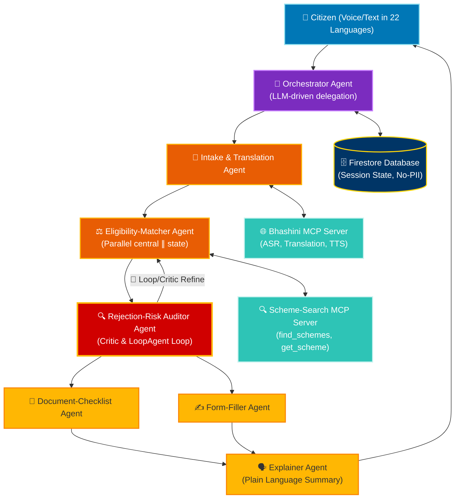

# SchemeWayfinder

> Find the government support you're entitled to.

A multi-agent system that takes a citizen's profile — spoken or typed in any of 22 Indian languages — and returns the welfare schemes they actually qualify for, a per-scheme document checklist, a pre-filled application draft, and a plain-language explanation of rejection risk. Built on Google's Agent Development Kit (ADK).

Submitted to the Kaggle × Google **AI Agents: Intensive Vibe Coding Capstone** — *Agents for Good* track.

<!-- TODO: add a screenshot or GIF of the live demo here once built -->
<!-- TODO: add docs/demo.gif (a short screen capture of the live run) once built -->
<!--  -->

---

## The problem

India runs over 3,000 central and state welfare schemes, yet thousands of crores in benefits go unclaimed every year — not because people are ineligible, but because they never discover the schemes exist, can't parse the eligibility rules, or don't know which documents to bring. The discovery process is a maze of portals, forms, and jargon, and it is hardest for exactly the people these schemes were created to help.

SchemeWayfinder shrinks the distance between a citizen and the support that is already theirs to claim.

---

## What it does

1. **Listens in any language.** The user describes their situation by voice or text in any of 22 Indian languages.
2. **Matches schemes.** It scores the profile against the scheme corpus and returns the ones the user is likely eligible for.
3. **Assembles the paperwork.** For each matched scheme, it produces the required-document checklist and a pre-filled application draft.
4. **Explains rejection risk.** It flags weak matches in plain language and tells the user how to strengthen the application — before they spend a day at an office.

---

## Why a multi-agent system (not a chatbot)

Welfare navigation is a pipeline of genuinely distinct expert tasks, which is what a multi-agent system is for. A single monolithic prompt would confidently invent schemes and requirements; the specialist split — and especially the auditor critic loop — is the quality guardrail.

| Agent | Role |
|-------|------|
| `Orchestrator` | LLM-driven delegation; routes the case and composes the final result |
| `Intake & Translation` | Captures the profile and works in the user's language (via Bhashini) |
| `Eligibility-Matcher` | Scores the profile against the scheme corpus |
| `Document-Checklist` | Assembles required documents per matched scheme |
| `Form-Filler` | Drafts the application from the captured profile |
| `Rejection-Risk Auditor` | **Critic loop** — re-checks every match against eligibility rules; flags weak/hallucinated eligibility |
| `Explainer` | Produces the final plain-language, in-language summary |

---

## Architecture



A citizen's voice or text (22 languages) enters the **Orchestrator** (ADK, LLM-driven delegation), which routes through an **Intake & Translation** agent, a **ParallelAgent** eligibility matcher (central ∥ state), and a **LoopAgent** rejection-risk auditor that re-checks every match before the document, form, and explainer agents run. A human-in-the-loop confirmation gates any application draft. Two MCP servers and a Gemini + Cloud Run + Firestore stack support the pipeline.

<details open>
<summary><b>Interactive Architecture Diagram (Mermaid)</b></summary>



</details>

**ADK patterns used:** `Orchestrator` (LLM-driven delegation) · `ParallelAgent` (central ∥ state scheme scoring) · `LoopAgent` (auditor critic-and-refine).

---

## Course concepts demonstrated

> Edit this list down to only what you actually ship. Three is the minimum; this targets all six. Only claim Antigravity if you genuinely build with it and capture the artifacts.

- [x] **Agent / multi-agent system (ADK)** *(code)* — orchestrator + six specialist sub-agents using Sequential/Parallel/Loop patterns.
- [x] **MCP server** *(code)* — a custom `scheme-search` MCP server (FastMCP) **plus** a consumed Bhashini MCP tool.
- [x] **Security** *(code/video)* — human-in-the-loop confirmation before any application is generated; PII minimization with session TTL; input guardrails on free-text fields.
- [x] **Deployability** *(video)* — containerized, deployed on Cloud Run with Firestore sessions; reproducible deploy script.
- [x] **Agent skills (Agents CLI)** *(code/video)* — four project-scoped skills under `.agents/skills/` (`adk-agent-scaffold`, `mcp-tool-scaffold`, `eval-harness`, `cloud-deploy`).
- [x] **Antigravity** *(video)* — built inside Antigravity; the build session, implementation plan, and browser-verification artifacts are shown in the demo video.

---

## Tech stack

- **Agents:** Google Agent Development Kit (ADK), Python
- **Models:** Gemini
- **Tools:** custom `scheme-search` MCP server (FastMCP); Bhashini MCP tool (ASR/MT/TTS)
- **Deploy:** Cloud Run (container), Firestore (session state)
- **Build:** Antigravity, agent skills

---

## Data sources (all public / open)

| Source | Used for |
|--------|----------|
| myScheme corpus — HF `shrijayan/gov_myscheme` / Kaggle "Indian Government Schemes" | scheme details, eligibility rules, required documents |
| Bhashini APIs (MeitY) | speech recognition, translation, TTS in 22 languages |
| data.gov.in | supplementary state-level scheme metadata |

No proprietary or paywalled data is used. The corpus is bundled for reproducibility; live sources are used for enrichment.

---

## Getting started

> Fill these in as the build solidifies — keep them runnable end-to-end.

### Prerequisites
- Python 3.11+
- A Google AI Studio / Vertex AI API key for Gemini  <!-- never commit keys -->
- A Bhashini API credential
- `gcloud` CLI (only if deploying to Cloud Run)

### Setup
```bash
git clone https://github.com/<your-username>/schemewayfinder-welfare.git
cd schemewayfinder-welfare
python -m venv .venv && source .venv/bin/activate
pip install -r requirements.txt
cp .env.example .env        # then fill in your keys
```

### Run locally
```bash
# start the custom MCP server
python -m schemewayfinder.mcp.scheme_search

# run the agent (ADK)
adk run schemewayfinder
# or the web UI:
adk web
```

### Deploy (optional)
```bash
gcloud run deploy schemewayfinder --source .
```

> ⚠️ **Never commit API keys or secrets.** Use `.env` (gitignored) and Secret Manager in production.

---

## Evaluation

> This is your differentiator — show numbers, not adjectives. Suggested:

- A small labeled test set of citizen personas with known-correct scheme matches.
- Report eligibility-match **precision/recall** and the **rejection-risk auditor's** effect (before/after the critic loop).
- Note coverage: number of schemes indexed, languages tested.

<!-- TODO: add a results table here once you have numbers -->

---

## Impact and limitations

SchemeWayfinder is an **informational navigator, not an official eligibility determination** — final eligibility always rests with the issuing authority. Every result carries a clear disclaimer; the Rejection-Risk Auditor exists specifically to reduce false hope by surfacing weak matches rather than over-promising; and human-in-the-loop confirmation ensures the user reviews and approves before any draft is produced. Public scheme data can be incomplete or out of date, so matches are presented as candidates to verify, not guarantees.

---

## Development workflow

SchemeWayfinder is built spec-driven and test-driven. The full plan lives in [`roadmap.md`](roadmap.md); each feature is a numbered spec with its own folder under `specs/`, built Red → Green → Refactor.

Slash-commands / Workflows (in `.agents/workflows/`) drive the loop:

| Command | Purpose |
|---------|---------|
| `/create-spec S1.1 scheme-corpus-loader` | Generate `spec.md` + `checklist.md` from the roadmap. |
| `/check-spec-deps S4.1` | Verify prerequisite specs are `done` and their tests pass. |
| `/implement-spec S1.1` | TDD implementation following the spec + checklist. |
| `/verify-spec S1.1` | Post-implementation audit: tests, lint, outcomes, wiring. |

Reusable **agent skills** (in `.agents/skills/`) scaffold the repetitive work — `adk-agent-scaffold`, `mcp-tool-scaffold`, `eval-harness`, `cloud-deploy` — each generating a component plus its matching test.

**Hooks** (in `githooks/`) enforce the non-negotiables at commit time: `secret-scan` blocks hardcoded keys and `no-pii-guard` blocks code that would persist citizen PII, alongside a pre-commit `make test` + `make lint` gate.

---

## Repository structure

```
schemewayfinder/                  # repo root
├── AGENTS.md                     # project instructions (auto-loaded each session)
├── README.md
├── roadmap.md                    # spec index the commands read
├── pyproject.toml                # uv, single source of truth
├── Makefile                      # make test / lint / eval / mcp / run / deploy
├── .env.example                  # placeholders only — never commit the real .env
├── .gitignore
│
├── .agents/                      # Antigravity agent tooling
│   ├── settings.json             # permissions + pre-commit hooks
│   ├── commands/                 # create-spec, check-spec-deps, implement-spec, verify-spec
│   └── hooks/                    # secret-scan.sh, no-pii-guard.sh
│
├── .agents/skills/               # agent skills (course concept)
│   ├── adk-agent-scaffold/SKILL.md
│   ├── mcp-tool-scaffold/SKILL.md
│   ├── eval-harness/SKILL.md
│   └── cloud-deploy/SKILL.md
│
├── specs/                        # one folder per spec (created by /create-spec)
│
├── app/                          # application code
│   ├── main.py                   # entry point (agent runner / web)
│   ├── core/                     # config.py, telemetry.py
│   ├── agents/                   # orchestrator + 6 specialists + contracts + guards
│   ├── mcp/
│   │   ├── scheme_search/        # custom FastMCP server (server.py, tools.py)
│   │   └── bhashini/             # consumed MCP tool (client.py)
│   ├── data/                     # loader.py, index.py
│   ├── models/                   # schemes.py (Pydantic)
│   ├── db/                       # session.py (Firestore TTL, PII minimization)
│   └── web/                      # demo UI + seeded personas
│
├── eval/                         # personas/, scorer.py, REPORT.md
├── tests/                        # mirrors app/ ; pytest ; externals mocked
├── deploy/                       # Dockerfile, deploy.sh
└── docs/                         # architecture.png, cover image, video link, antigravity/
```

---

## Acknowledgements

Government scheme data from the myScheme corpus and data.gov.in; multilingual capabilities via Bhashini (MeitY). Built for the Kaggle × Google AI Agents: Intensive Vibe Coding Capstone.

## License

<!-- TODO: choose a license (MIT is a safe default for a hackathon) -->
